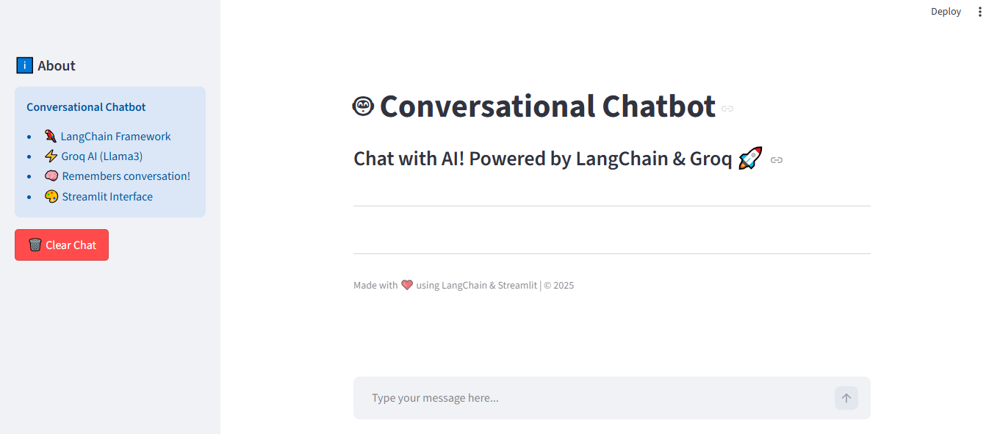
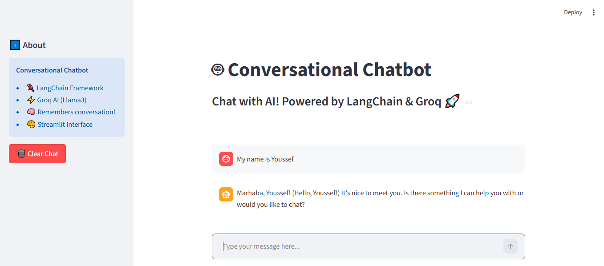
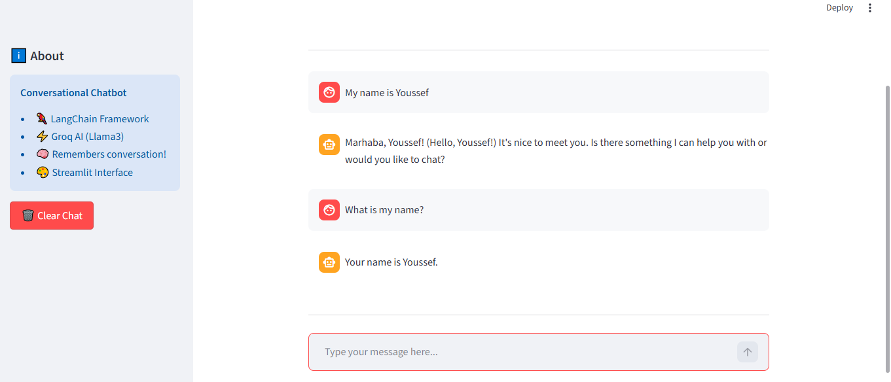

# 🤖 Conversational Chatbot

A conversational AI chatbot built with LangChain and Groq AI that remembers the full conversation context.



## 🚀 Live Demo

👉 [Try the App](https://youssefkhaled-app-langchain-ucoh82nblw2lzjnajupkmn.streamlit.app)

## 🎯 About The Project

Unlike simple Q&A apps, this chatbot **remembers the entire conversation**,
allowing for natural, context-aware interactions. Built with LangChain and Groq's
ultra-fast Llama3 model.

## ✨ Features

- 🧠 Full conversation memory (remembers context)
- ⚡ Powered by Groq AI (Llama3) - extremely fast
- 🦜 Built with LangChain framework
- 🎨 Clean chat interface with Streamlit
- 🗑️ Clear chat functionality

## 🛠️ Technologies Used

- **LangChain** - Framework for LLM applications
- **Groq AI** - Llama3 model for fast inference
- **Streamlit** - Web interface
- **Python 3.10+**

## 📸 Screenshots





## 🚀 Installation

1. Clone the repository:
```bash
git clone https://github.com/YoussefK-Ismail/Conversational-App-LangChain.git
cd Conversational-App-LangChain
```

2. Install dependencies:
```bash
pip install -r requirements.txt
```

3. Create `.env` file:
```
GROQ_API_KEY=your_groq_api_key_here
```

4. Run the app:
```bash
streamlit run app.py
```

## 💡 Usage

1. Type your message in the chat input
2. The chatbot responds while remembering previous messages
3. Use **"Clear Chat"** to start a new conversation

## 🔮 Future Improvements

- [ ] Add Arabic language support
- [ ] Export conversation history
- [ ] Add different AI personas
- [ ] Voice input/output

## 👤 Author

**Youssef Khaled**
- 🌐 Portfolio: [youssefkhaledportfolio.netlify.app](https://youssefkhaledportfolio.netlify.app)
- 💻 GitHub: [@YoussefK-Ismail](https://github.com/YoussefK-Ismail)

## 📄 License

MIT License

---
Made with ❤️ using LangChain & Streamlit
